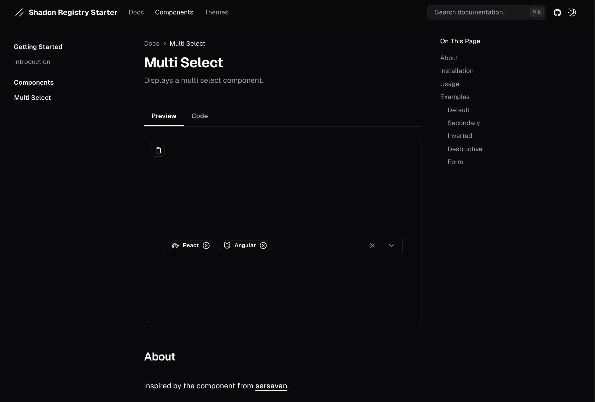
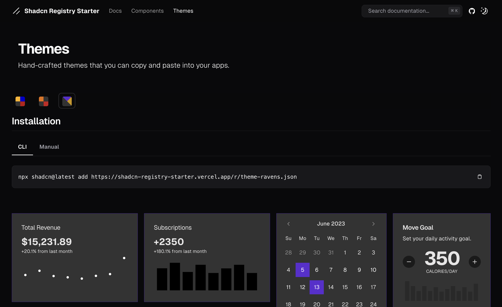

# Shadcn Registry Starter

Documentation: https://shadcn-registry-starter.vercel.app/

This repository serves as a **template for building a Shadcn component registry**, allowing individuals and organizations to easily **share and display custom components, themes, utilities, and hooks**. 

It also functions as a **documentation site** to guide users through installation and usage.

